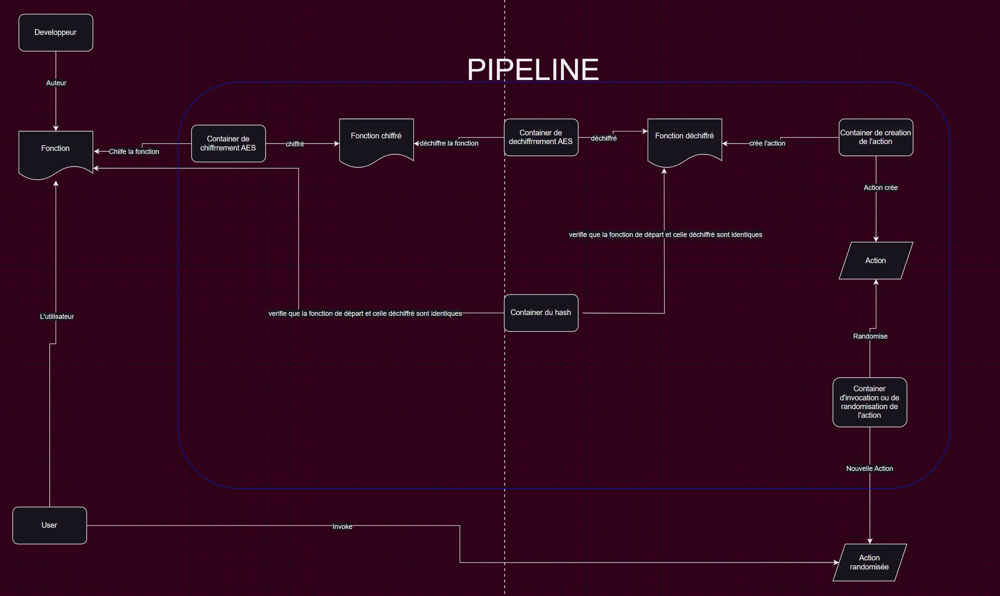

# rsfass (Exécution anonymisé des Faas)

Ce projet porte sur la création et l'éxécution sécurisé des fonctions (actions) via des framework comme *Openwhisk, OpenFaas, Firecracker*. L'objectif est d'une part au développeur de sécuriser ses fonctions et de les rendre disponible sans que les fournisseurs de cloud n'aient accès à cela. D'autre part, la plateforme devra garaantir au developpeur l'impossibilité de pouvoir faire de la rétroingénieurie via les ressources utilisées par l'application en permettant de randomiser ses fonctions  ou actions. Pour ce faire, nous avons opté pour une ochestration de containers . Les fonctions seront chiffré, hashé. Par la suite nous allons créer des actions via nos chiffré et au moment de leur invocation on procédera au déchiffrement. POur ce qui est de la randomisation l'on a opté par un appel d'autres fonctions lors de l'éxécution de notre actions principale ce qui aura pour effet d'augmenter le temps d'éxécution, d'augmenter la capacité mémoire, bref les ressources allouées à notre programme. 

## Membres
- BALEBA WILFRIED AUDREY
- KANNET BILOUNGA HERVE JONATHAN
- DOUNGUE DJATSA MODESTE

## Prérequis
- Os : Ubuntu Desktop 22.04
- Installer **Java, nodejs, python3, pip3, npm, docker, docker-compose, gradle (version 6.9.1)**
- Installer **Openwhisk** via [Installation apache openwhisk](https://github.com/apache/openwhisk)
- Une fois Openwhisk installé, configuré l'utilisation de **Openwhisk command line** appelée **wsk**
- Une fois que tout est fait lancé l'exécution de Openwhisk dans un terminal **sudo ./gradlew core:standalone:bootRun**

## Architecture de notre solution



## Exécuter le conteneur pour le chiffrement AES

Dans le dossier AES_encrypt éxécutons d'abord ```docker build -t aes_encrypt```

exemple : ```docker run -it -v /chemin code d'entré:/Inputs_Faas -v /chemin dossier de sortie:/Outputs_Faas aes_encrypt``` 

## Exécuter le conteneur pour le déchiffrement AES

Dans le dossier AES_decrypt éxécutons d'abord ```docker build -t aes_decrypt```

exemple : ```docker run -it -v /chemin dossier de sortie:/Outputs_Faas aes_decrypt``` 

## Exécuter le conteneur pour hash 

Ce Container vérifie que le code déchiffré est équivalent à celui du départ en comparant le hash des deux.
Dans le dossier hash éxécutons d'abord ```docker build -t hash```

exemple : ```docker run -it -v /chemin code d'entré:/Inputs_Faas -v /chemin dossier de sortie:/Outputs_Faas hash``` 

## Exécuter le conteneur pour la création d'une action chiffrée

Dans le dossier actions_create éxécutons d'abord ```docker build -t actions_create```

exemple : ```docker run -it -v /chemin dossier de sortie:/Outputs_Faas action_create``` 

## Exécuter le conteneur pour l'invocation  de l'action chiffrée précédemment 

Dans le dossier actions_invoke éxécutons d'abord ```docker build -t actions_invoke```

exemple : ```docker run -it -v /chemin dossier de sortie:/Outputs_Faas actions_invoke```

## Comment traiter notre fonction ou code
1. écrire votre code javascript dans le fichier **./Inputs_Faas/hello.js**
2. Définir la clé de chiffrement/déchiffrement dans le fichier **./Inputs_Faas/key.txt**. La clé peut être de longuer 16, 24 ou 32 caractères. Dans ce cas elle est de **16 caractères**
3. Lancer la stack de conteneur pour le traitement avec la commande ```sudo docker compose up```
4. Le résultat des opérations se trouve dans le fichier **./Outpus_Faas**, on pourra inérroger wsk list actions pour voir nos actions crées à tout instant